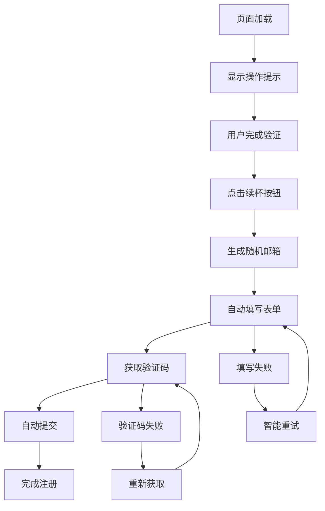

# 🚀 Augment自动续杯工具

[](https://opensource.org/licenses/MIT)
[](https://chrome.google.com/webstore)
[](https://github.com/getwName/augment-auto-refill)

> 🎯 一个智能的Chrome浏览器扩展，专为Augment平台设计的自动注册续杯工具。通过用户协助验证模式，实现从邮箱生成到验证码处理的全流程自动化。

## ✨ 特性

- 🤖 **智能自动化** - 自动生成邮箱、填写表单、处理验证码
- 🛡️ **现代验证兼容** - 支持Cloudflare Bot Management等现代验证系统
- 👥 **用户协助模式** - 用户处理验证，插件处理自动化流程
- 🎨 **友好界面** - 清晰的操作指引和实时状态反馈
- ⚙️ **灵活配置** - 可自定义邮箱域名和前缀长度
- 🔄 **智能重试** - 多层备用方案确保成功率
- 📝 **详细日志** - 完整的操作日志便于调试

## 🎬 演示


*用户只需手动完成验证，其余流程全自动化*

## 🚀 快速开始

### 安装

#### 方法一：从源码安装（推荐）

1. **克隆仓库**
   ```bash
   git clone https://github.com/getwName/augment-auto-refill.git
   cd augment-auto-refill
   ```

2. **构建扩展**
   ```bash
   npm install
   npm run build
   ```

3. **加载到Chrome**
   - 打开Chrome浏览器
   - 访问 `chrome://extensions/`
   - 开启"开发者模式"
   - 点击"加载已解压的扩展程序"
   - 选择项目的 `dist` 文件夹

#### 方法二：下载预构建版本

[](https://github.com/getwName/augment-auto-refill/releases/tag/1.0.0%E7%89%88%E6%9C%AC)

1. **直接下载**：[点击下载 Augment自动续杯工具.zip](https://github.com/getwName/augment-auto-refill/releases/tag/1.0.0%E7%89%88%E6%9C%AC)
2. **或访问** [Releases页面](https://github.com/getwName/augment-auto-refill/releases) 选择版本
3. 解压下载的ZIP文件
4. 在Chrome扩展页面加载解压后的文件夹

### 配置

#### 第一步：打开设置页面
1. **安装扩展后**，在Chrome工具栏找到扩展图标
2. **点击扩展图标** 打开设置页面


*扩展设置页面界面*

#### 第二步：配置邮箱设置


*邮箱配置界面*

**必填配置项**：
- **注册域名邮箱**：自己的域名用来注册Augment，如 `@gmail.com`、`@outlook.com`
- **临时邮箱用户名**：临时邮箱的用户名部分
- **临时邮箱后缀**：临时邮箱的域名后缀
- **ping码**：用来查询接收到的验证码
- **随机字符串位数**：推荐7个以内，太长注册不了（默认是12）

**配置示例**：
```
注册域名邮箱: @gmail.com
临时邮箱用户名: testuser
临时邮箱后缀: @tempmail.plus
ping码: abc123
随机字符串位数: 7
```
生成结果：注册邮箱 `A7k9Xm2@gmail.com`，临时邮箱 `testuser@tempmail.plus`

#### 第三步：保存设置
1. **填写完成后**点击"保存设置"按钮
2. **看到成功提示**即表示配置完成
3. **现在可以使用**自动续杯功能


*配置保存成功提示*

## 📖 使用指南

### 基本使用流程

1. **访问Augment登录页面**
   - 页面加载后会自动显示操作提示

2. **完成验证**
   - 根据提示先完成页面上的验证（如Cloudflare验证）

3. **点击续杯按钮**
   - 点击页面上的"续杯"按钮开始自动流程

4. **等待完成**
   - 插件会自动处理邮箱填写、验证码获取、表单提交等

### 详细操作步骤

```
📋 操作步骤：
1️⃣ 先完成页面上的验证（点击"我不是机器人"等）
2️⃣ 然后点击"续杯"按钮开始自动注册
💡 验证码部分将自动处理
```

### 支持的验证系统

- ✅ Cloudflare Bot Management
- ✅ Private Access Token验证
- ✅ PostHog行为分析
- ✅ 沙盒安全框架
- ✅ 传统人机验证

## ⚙️ 配置选项详解

### 配置参数说明

| 配置项 | 说明 | 是否必填 | 默认值 | 推荐值 | 示例 |
|--------|------|----------|--------|--------|------|
| **注册域名邮箱** | 自己的域名用来注册Augment | ✅ 必填 | 无 | `@gmail.com` | `@gmail.com`、`@outlook.com` |
| **临时邮箱用户名** | 临时邮箱的用户名部分 | ✅ 必填 | 无 | 简短易记 | `testuser`、`myemail` |
| **临时邮箱后缀** | 临时邮箱的域名后缀 | ✅ 必填 | 无 | `@tempmail.plus` | `@tempmail.plus` |
| **ping码** | 用来查询接收到的验证码 | ✅ 必填 | 无 | 简短字符串 | `abc123`、`test01` |
| **随机字符串位数** | 注册邮箱前缀的字符数 | ❌ 可选 | 12 | 7个以内 | `5`、`6`、`7` |

### 界面配置方式

**在扩展设置页面中**：
- **注册域名邮箱输入框**：输入完整域名（包含@符号）
- **临时邮箱用户名输入框**：输入用户名部分（不含@符号）
- **临时邮箱后缀输入框**：输入完整域名（包含@符号）
- **ping码输入框**：输入查询验证码用的标识码
- **随机字符串位数输入框**：输入数字（推荐7以内）
- **保存按钮**：点击保存配置

### 配置示例对比

| 配置 | 注册域名邮箱 | 临时邮箱用户名 | 临时邮箱后缀 | ping码 | 随机位数 | 生成结果示例 |
|------|-------------|---------------|---------------|--------|----------|--------------|
| 示例1 | `@gmail.com` | `testuser` | `@tempmail.plus` | `abc123` | `6` | 注册邮箱: `A7k9Xm@gmail.com` |
| 示例2 | `@outlook.com` | `myemail` | `@tempmail.plus` | `test01` | `7` | 注册邮箱: `B3n8Yz5@outlook.com` |
| 示例3 | `@yahoo.com` | `demo` | `@tempmail.plus` | `xyz789` | `5` | 注册邮箱: `C9m4K@yahoo.com` |

### 推荐配置

**最佳实践配置**：
```
注册域名邮箱: @gmail.com
临时邮箱用户名: testuser
临时邮箱后缀: @tempmail.plus
ping码: abc123
随机字符串位数: 6
```

**原因**：
- ✅ Gmail兼容性最好，注册成功率高
- ✅ tempmail.plus服务稳定，验证码接收快
- ✅ 6位长度既保证唯一性又避免注册失败
- ✅ 简短ping码便于查询验证码

### 高级配置说明

**注册域名邮箱选择建议**：
- 🥇 **推荐**: `@gmail.com` - 兼容性最佳，注册成功率高
- 🥈 **备选**: `@outlook.com` - 微软服务，稳定性好
- 🥉 **可用**: `@yahoo.com` - 雅虎服务，基本可用

**临时邮箱服务建议**：
- 🥇 **推荐**: `@tempmail.plus` - 服务稳定，验证码接收快
- 🥈 **备选**: 其他临时邮箱服务

**随机字符串位数选择建议**：
- **5位**: 最短，但可能重复
- **6位**: 推荐使用，平衡唯一性和成功率
- **7位**: 较安全，但接近长度限制
- **8位以上**: 不推荐，容易导致注册失败

### 配置验证

配置完成后，系统会：
1. ✅ **验证域名格式** - 确保注册域名和临时邮箱后缀包含@符号
2. ✅ **检查字符串位数** - 确保随机位数在合理范围内（推荐7以内）
3. ✅ **验证ping码格式** - 确保ping码为有效字符串
4. ✅ **测试生成功能** - 验证能否正常生成注册邮箱
5. ✅ **保存到本地** - 安全存储在浏览器中

## 🛠️ 开发

### 环境要求

- Node.js 16+
- Chrome 88+

### 本地开发

```bash
# 克隆项目
git clone https://github.com/getwName/augment-auto-refill.git
cd augment-auto-refill

# 安装依赖
npm install

# 开发模式
npm run dev

# 构建生产版本
npm run build

# 打包扩展
npm run package
```

### 项目结构

```
src/
├── manifest.json          # 扩展配置文件
├── content.js             # 内容脚本（主要逻辑）
├── background.js          # 后台脚本
├── augmentVIP.html        # 设置页面
├── augmentVIP.js          # 设置页面逻辑
└── icon-*.png            # 扩展图标
```

### 核心技术

- **内容脚本注入** - 在目标页面执行自动化逻辑
- **DOM事件模拟** - 模拟真实用户操作
- **智能状态检测** - 实时监听页面状态变化
- **异步流程控制** - Promise-based的流程管理
- **错误处理机制** - 多层备用方案

### 技术架构

```
┌─────────────────┐    ┌─────────────────┐    ┌─────────────────┐
│   用户界面      │    │   内容脚本      │    │   后台脚本      │
│                 │    │                 │    │                 │
│ • 设置页面      │◄──►│ • 页面检测      │◄──►│ • 存储管理      │
│ • 状态提示      │    │ • 自动化逻辑    │    │ • 权限管理      │
│ • 操作按钮      │    │ • 事件模拟      │    │ • 后台任务      │
└─────────────────┘    └─────────────────┘    └─────────────────┘
```

### 工作流程



## 🔧 故障排除

### 常见问题

**Q: 扩展无法加载？**
A: 确保Chrome版本 >= 88，并检查是否开启了开发者模式。

**Q: 验证码获取失败？**
A: 检查网络连接，确保临时邮箱服务可访问。

**Q: 自动填写不工作？**
A: 检查页面是否完全加载，尝试刷新页面重试。

**Q: 如何查看详细日志？**
A: 按F12打开开发者工具，查看Console标签页的日志输出。

### 调试模式

开启详细日志：
```javascript
// 在控制台执行
localStorage.setItem('augment_debug', 'true');
```

## 🔒 隐私与安全

- ✅ **本地处理** - 所有数据在本地处理，不上传到远程服务器
- ✅ **最小权限** - 仅请求必要的浏览器权限
- ✅ **开源透明** - 代码完全开源，可审查安全性
- ✅ **无数据收集** - 不收集任何用户个人信息

## 📊 兼容性

| 浏览器 | 版本要求 | 支持状态 |
|--------|----------|----------|
| Chrome | 88+ | ✅ 完全支持 |
| Edge | 88+ | ✅ 完全支持 |
| Firefox | - | ❌ 暂不支持 |
| Safari | - | ❌ 暂不支持 |

## 🤝 贡献

欢迎贡献代码！请查看 [贡献指南](CONTRIBUTING.md) 了解详情。

### 贡献方式

1. Fork 本仓库
2. 创建特性分支 (`git checkout -b feature/AmazingFeature`)
3. 提交更改 (`git commit -m 'Add some AmazingFeature'`)
4. 推送到分支 (`git push origin feature/AmazingFeature`)
5. 开启 Pull Request

### 开发规范

- 遵循 ESLint 代码规范
- 添加适当的注释和文档
- 确保所有功能都有对应的测试
- 提交前运行 `npm run lint` 检查代码

## 📄 许可证

本项目采用 MIT 许可证 - 查看 [LICENSE](LICENSE) 文件了解详情。

## 🙏 致谢

- 感谢 [Augment](https://augmentcode.com) 提供优秀的开发平台
- 感谢所有贡献者的支持和反馈

## 📞 支持

如果你遇到问题或有建议，请：

- 📝 [提交Issue](https://github.com/getwName/augment-auto-refill/issues)
- 💬 [参与讨论](https://github.com/getwName/augment-auto-refill/discussions)

---

<div align="center">

**⭐ 如果这个项目对你有帮助，请给个Star支持一下！**

Made with ❤️ by [getwName](https://github.com/getwName)

</div>